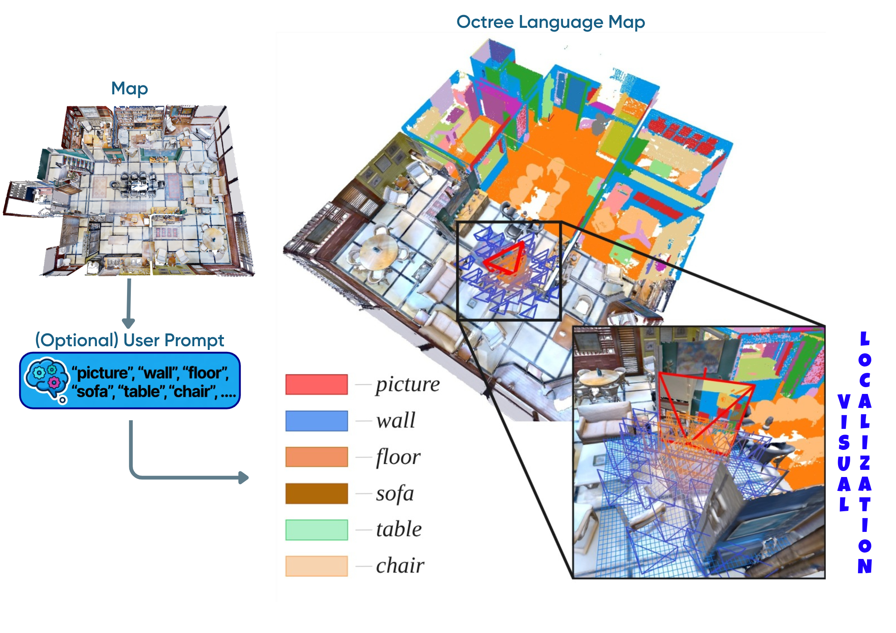
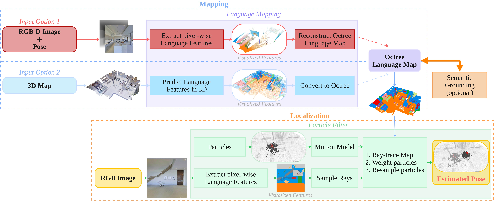

<h3 align="left">
  <a href="https://arxiv.org/abs/2512.15557">Paper</a> |
  <a href="https://github.com/AIS-Bonn/omcl">Video (soon)</a> |
  <a href="https://github.com/AIS-Bonn/omcl">Poster (soon)</a>  
</h3>

# OMCL: Open-vocabulary Monte Carlo Localization

We present <b>OMCL</b> (Open-vocabulary Monte Carlo Localization), a localization framework that extends <b>Monte Carlo Localization</b> with <b>vision-language features</b>.
Our <b>Ocree Language Map</b> enables <b>OMCL</b> to perform <b>visual-only</b> localization in 3D environments while generalizing across different scales.
By grounding pose estimation in language features, <b>OMCL</b> accelerates global localization through <b>open-vocabulary prompts</b>.

<div style="margin-top: 10px;"><b>Cross-modal sensor support:</b></div>
<div style="margin-left: 12px;">
<div>Mapping:</div>
<ul style="margin-top: 0; margin-bottom: 0;">
  <li><i>RGB-D</i></li>
  <li><i>Point clouds</i></li>
</ul>
<div>Localization:</div>
<ul style="margin-top: 0; margin-bottom: 0;">
  <li><i>Visual (RGB)</i></li>
</ul>
</div>

## Approach
<!-- 
 -->
<p> </p>


## Installation 
Build Docker image: 

    ./docker/build.sh 

Install <a href="https://pixi.prefix.dev/latest/"> pixi</a>:

    curl -fsSL https://pixi.sh/install.sh | sh


## Datasets
Detailed instuctions for automatic datasets preparation are provided in [DATA.md](DATA.md).

# Matterport 3D
## Mapping

Extract Language Features (for mapping with Option 1 and Localization)

    ./docker/run.sh
    python3 data_scripts/matterport/extract_lang_features.py

Create Octree Language Map: 

#### (Option 1) from RGB-D images:

    ./docker/run.sh
    python3 data_scripts/matterport/create_map.py

#### (Option 2) from point cloud:

    ./docker/run.sh
    python3 data_scripts/matterport/create_map.py visual_model=open_scene


## Localization

Visualization is available at <a href="http://0.0.0.0:8080/">http://0.0.0.0:8080</a>

Matterport3D + LSeg:

    ./docker/run.sh
    python3 omcl/examples/localize_mp3d.py 


Matterport3D + OpenScene:

    ./docker/run.sh
    python3 omcl/examples/localize_mp3d.py visual_model=open_scene


## Prompt-augmented Initialization (Global Localization)


    python3 omcl/examples/global_localization.py 

Press Enter to interact with the visualization.


# SemanticKITTI

## Mapping
From this `.` directory without docker:

    pixi run install_xdecoder
    pixi run extract_language_features_sem_kitti

Inside the docker:

    ./docker/run.sh 
    python3 data_scripts/semantic_kitti/create_map.py

## Localization
    soon


# Citation

If you use OMCL in an academic work, please cite:

```bibtex
@article{kruzhkov2026omcl,
  title={OMCL: Open-vocabulary Monte Carlo Localization},
  author={Kruzhkov, Evgenii and Memmesheimer, Raphael and Behnke, Sven},
  journal={IEEE Robotics and Automation Letters (RA-L)},
  volume={11},
  number={3},
  pages={2698--2705},
  year={2026},
  codeurl={https://github.com/AIS-Bonn/omcl},
}

@inproceedings{kruzhkov2025lilmaps,
  title={LiLMaps: Learnable Implicit Language Maps},
  author={Kruzhkov, Evgenii and Behnke, Sven},
  booktitle={2025 IEEE/CVF Winter Conference on Applications of Computer Vision (WACV)},
  year={2025},
  organization={IEEE}
}

```